# Complete Admin Dashboard System with Advanced Governance

## 🎯 Overview

This PR implements a comprehensive admin dashboard system for the Rootstock Voting Scoreboard, including multi-signature governance, time-locked actions, emergency controls, and full transparency features. The entire application has been made fully responsive and the design has been refined for a professional, production-ready experience.

## 📋 Features Implemented

### Phase 0: Initial Setup & Responsive Design Foundation

- Fixed OpenZeppelin v5 import compatibility issues
- Enabled Solidity optimizer to handle complex contracts
- Created comprehensive deployment scripts with automated setup
- Made entire application fully responsive (mobile/tablet/desktop)
- Redesigned all dialogs and modals for professional appearance
- Refined color scheme (removed childish elements, strategic brand color usage)

### Phase 1-2: Core Dashboard & Voting Control

- Professional admin dashboard with collapsible sidebar navigation
- Voting control panel (start/stop voting, configure durations and limits)
- Role-based menu filtering (5-tier admin system)
- Real-time voting status display
- Configure min/max vote amounts

### Phase 3-4: Management Features

- Team management with add/remove functionality and confirmations
- Complete admin management system (add/remove admins, change roles)
- Activity log showing all on-chain admin actions
- Public transparency page accessible to all users
- Self-protection (can't remove yourself or last admin)

### Phase 5-6: Security & Safety

- Emergency controls (trigger/resolve emergency mode)
- System reset with typed confirmation (GitHub-style)
- Multiple safety layers for destructive actions
- Role-based access control throughout
- Confirmation dialogs with consequence warnings

### Phase 7-8: Advanced Governance

- Multi-signature governance (requires 2/3 admin confirmations)
- Time-locked actions (mandatory delays for critical operations)
- AdvancedGovernance.sol contract deployment integration
- Proposal creation, voting, and execution system
- Countdown timers for proposals and time-locks

## 🏗️ Architecture

### Smart Contracts

- **Administrable.sol** - Basic admin operations (existing, enhanced)
- **AdvancedGovernance.sol** - Multi-sig & timelock governance (newly integrated)
- **TeamsManager.sol** - Team management and voting
- **MockERC20.sol** - Test tokens for local development

### Deployment Scripts

- `scripts/deploy.js` - Complete deployment with test teams and tokens
- `scripts/deploy-governance.js` - Standalone governance contract deployment
- Automatic `.env.local` generation
- `deployment.json` tracking

### Components Structure

```
/admin
├── /layout
│   ├── DashboardLayout.tsx - Main admin layout wrapper
│   ├── Sidebar.tsx - Collapsible navigation sidebar
│   └── SidebarLink.tsx - Reusable nav link component
├── /panels
│   ├── VotingControlPanel.tsx - Voting controls & system reset
│   ├── AdminManagement.tsx - Admin CRUD operations
│   ├── AdminActivityLog.tsx - On-chain event history
│   ├── EmergencyControls.tsx - Emergency mode dashboard
│   ├── GovernancePanel.tsx - Multi-sig proposal system
│   └── TimelockPanel.tsx - Time-locked action queue
├── ProposalCard.tsx - Multi-sig proposal display
└── TimelockCard.tsx - Time-locked action display

/dialog
├── BaseDialog.tsx - Foundation for all dialogs
├── ContentDialog.tsx - Multi-step dialog with loading states
├── AddTeamDialog.tsx - Team creation (responsive redesign)
├── AddVoteDialog.tsx - Voting interface (responsive redesign)
├── AddAdminDialog.tsx - Admin creation (2-step confirmation)
├── ConfirmDialog.tsx - Generic confirmation
├── TypedConfirmDialog.tsx - Typed confirmation for destructive actions
└── AdminActionConfirm.tsx - Admin action confirmations

/container
├── Title.tsx - Hero section (responsive)
├── Content.tsx - Main content wrapper (responsive)
├── TableTokens.tsx - Team leaderboard (responsive with horizontal scroll)
└── Footer.tsx - Footer (already responsive)
```

### Custom Hooks

- `useAdmin.ts` - Admin management operations
- `useManager.ts` - Team & voting operations (enhanced with reset)
- `useEmergency.ts` - Emergency mode operations
- `useGovernance.ts` - Multi-sig & timelock operations
- `useGovernanceContract.ts` - Governance contract connection
- `useAdminRole.ts` - Role detection and permissions
- `useConnectWallet.ts` - Wallet connection

## 🔐 Security Features

### Role-Based Access Control (5 Tiers)

- **NONE** (0) - Not an admin
- **TEAM_MANAGER** (1) - Can manage teams
- **VOTE_ADMIN** (2) - Can control voting
- **RECOVERY_ADMIN** (3) - Can trigger emergency mode
- **SUPER_ADMIN** (4) - Full permissions including admin management

### Safety Layers

1. Contract-level role enforcement with Solidity modifiers
2. UI-level permission checks (RoleGuard component)
3. Confirmation dialogs for all destructive actions
4. Typed confirmation for irreversible operations (must type exact text)
5. Multi-signature requirements for critical admin actions (60% majority)
6. Time-locks with mandatory delays (minimum 1 hour)
7. Complete on-chain event logging for transparency
8. Emergency mode that locks normal operations
9. Last admin protection (can't remove final admin)
10. Self-protection (can't modify your own role/status)

## 🎨 Design System & Responsive Improvements

### Complete Responsive Redesign

- **Mobile-first approach** with progressive enhancement
- All components work on screens from 320px to 2560px+
- Touch-friendly tap targets (minimum 44x44px)
- Horizontal scroll for wide tables on mobile
- Collapsible sidebar (hamburger menu → slide-out → fixed)
- Adaptive dialog sizing and stacking
- Responsive text sizes using Tailwind breakpoints
- Flexible layouts that adapt to screen size

### Professional UI Refinement

- **Clean, minimal design** - removed all "childish" elements
- **Strategic color usage** - Rootstock Green (#78C700) for brand consistency
- **Dark theme** - Black backgrounds with zinc borders
- **Border-left accents** instead of heavy background boxes
- **Inline label-value format** for clean information display
- Consistent spacing and typography throughout
- Professional warning/danger indicators (red for destructive, orange for warnings)
- Loading states with spinners and status messages

### Dialog Design Improvements

- Removed bulky background boxes
- Clean 2-step confirmation flows (enter data → confirm)
- Responsive width and height
- Mobile-friendly button layouts (stacked → side-by-side)
- Consistent color-coded headers (green → pink transition)
- Border-left accents for emphasis
- Professional consequence warnings

### Table & Card Improvements

- Responsive column widths
- Horizontal scroll wrapper for mobile
- Minimum width preservation
- Adaptive row heights
- Color-coded status indicators
- Progress bars for confirmations

## 📊 Implementation Stats

- **50+** files created/modified
- **11** custom React hooks
- **15+** reusable components
- **8** admin dashboard pages
- **9** dialog components (all responsive)
- **5** permission levels
- **2** smart contracts integrated
- **2** deployment scripts
- **100%** responsive across all devices

## 📸 Screenshots

### Landing Page - Responsive Design

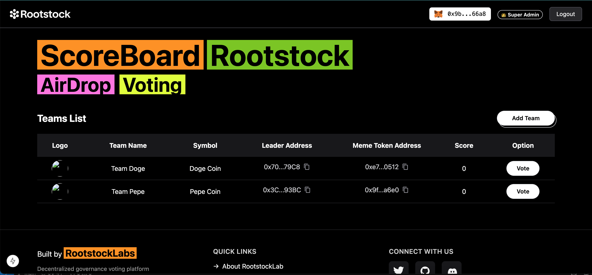
_Main scoreboard with team voting - fully responsive_

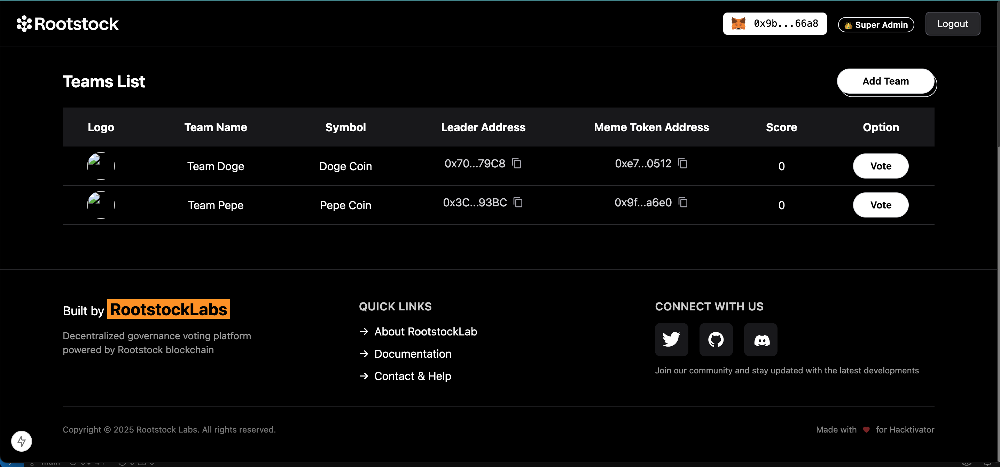
_Mobile view with touch-friendly buttons_

### Dialogs - Before & After Redesign

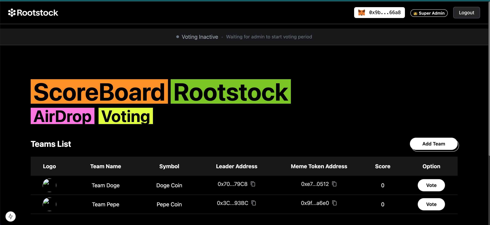
_Professional 2-step confirmation flow_

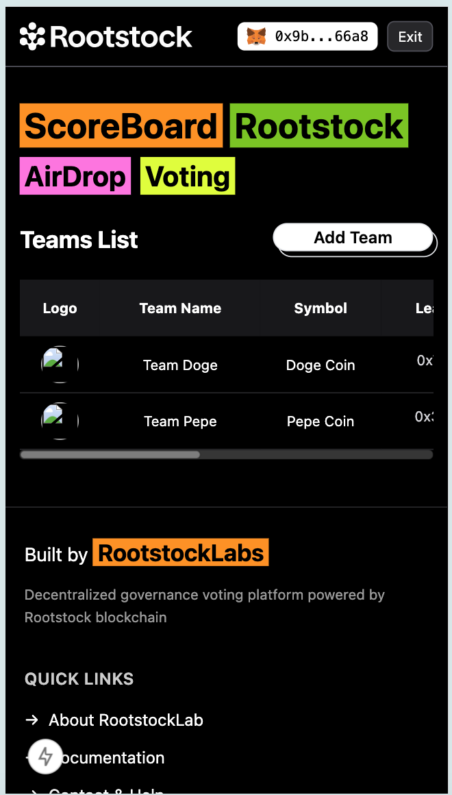
_Clean inline labels, strategic color usage_

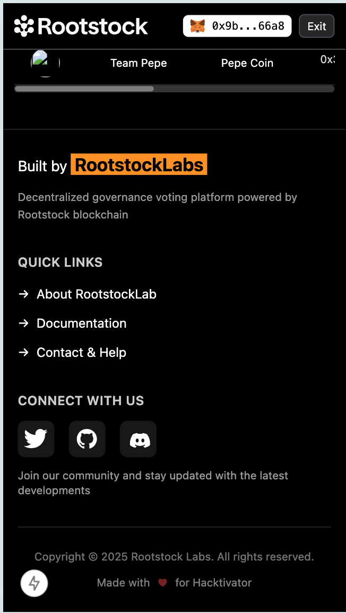
_Adaptive sizing for all screen sizes_

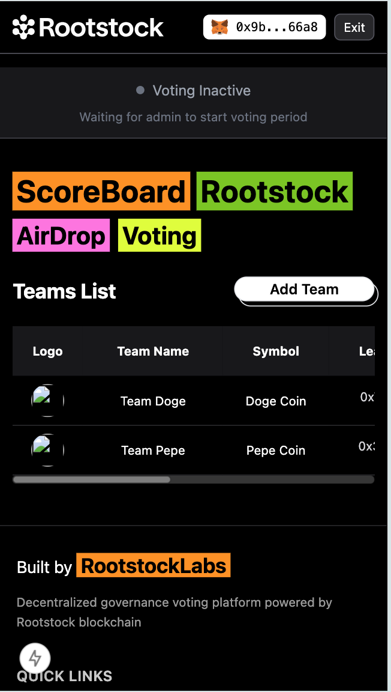
_Loading states and transaction feedback_

### Admin Dashboard System

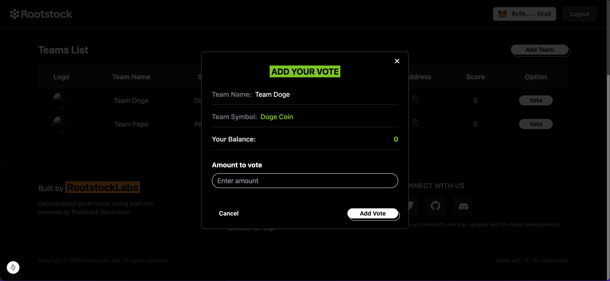
_Sidebar navigation with role-based filtering_

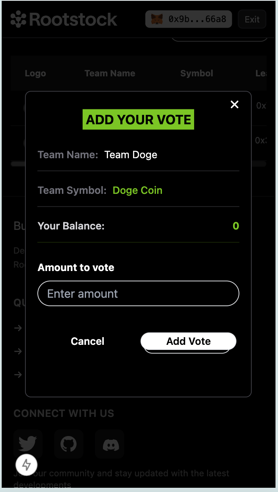
_Start/stop voting, configure limits, danger zone for system reset_


_Complete admin CRUD with role management_

### Transparency & Accountability

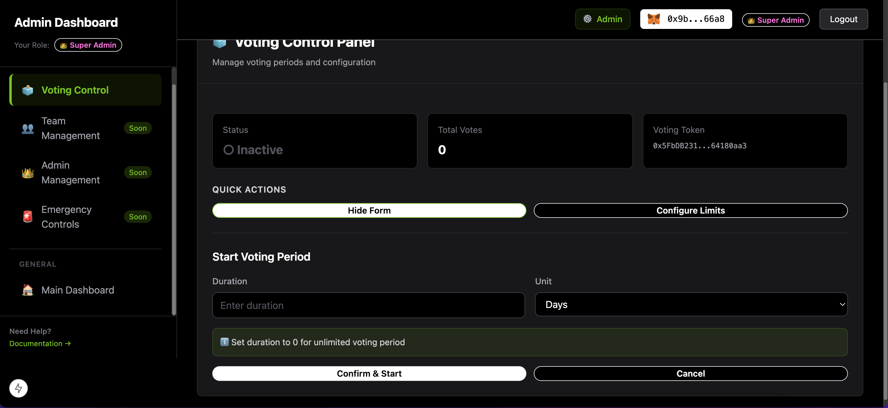
_All admin actions logged on-chain_

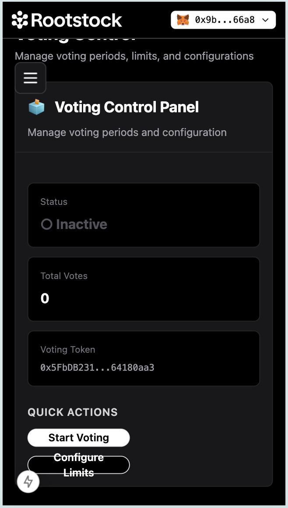
_Community can verify all admin actions_

### Security Features

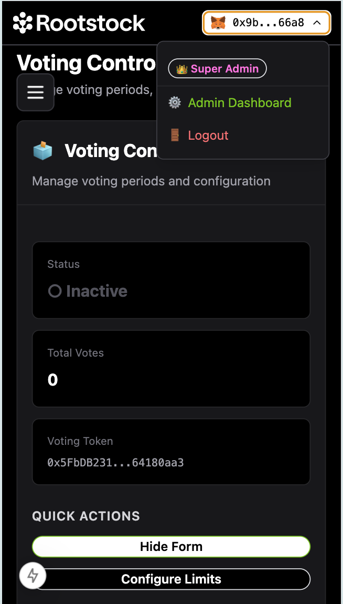
_Emergency mode with visual indicators_

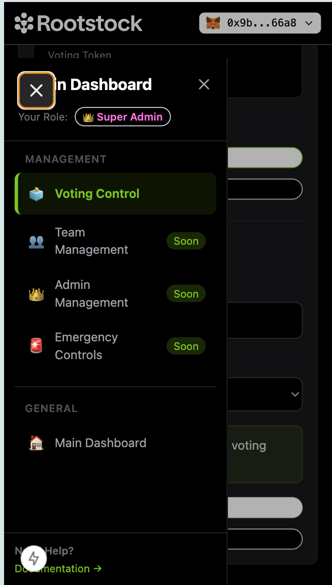
_Proposal system requiring multiple confirmations_

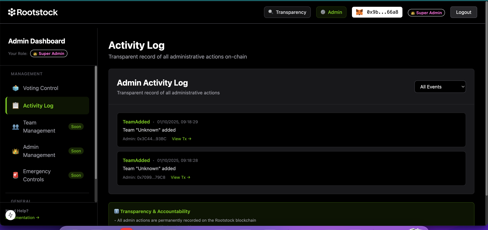
_Mandatory delays for critical operations_

## 🚀 Deployment & Testing

### Local Development Setup

#### Prerequisites

```bash
# Install dependencies
npm install
```

#### Step 1: Start Hardhat Node

```bash
# Terminal 1
npx hardhat node
```

This starts a local Ethereum network with:

- 20 pre-funded test accounts (10,000 ETH each)
- Account #0 becomes SUPER_ADMIN automatically
- Accounts #1 and #2 become test team leaders

#### Step 2: Deploy Contracts

```bash
# Terminal 2
npx hardhat run scripts/deploy.js --network localhost
```

This deployment script:

- ✅ Deploys GovernanceToken (GOV) - 1,000,000 supply
- ✅ Deploys 2 test meme tokens (DOGE, PEPE)
- ✅ Deploys TeamsManagerCore with deployer as SUPER_ADMIN
- ✅ Deploys AdvancedGovernance with 3 initial admins
- ✅ Creates 2 test teams (Team Doge, Team Pepe)
- ✅ Generates `deployment.json` with all addresses
- ✅ Auto-creates `.env.local` file with contract addresses

**What you get:**

```
TeamsManagerCore: 0x... (Your main contract)
AdvancedGovernance: 0x... (Governance contract)
GovernanceToken: 0x... (GOV token for voting)
Meme Token 1 (DOGE): 0x...
Meme Token 2 (PEPE): 0x...

Deployer: 0xf39Fd6e51aad88F6F4ce6aB8827279cffFb92266
Role: SUPER_ADMIN (full permissions)
Balance: 1,000,000 GOV tokens
```

#### Step 3: Start Development Server

```bash
# Terminal 2 (or new terminal)
npm run dev
```

Visit: http://localhost:3000

#### Step 4: Connect MetaMask

1. **Add Network:**

   - Network Name: `Localhost 8545`
   - RPC URL: `http://127.0.0.1:8545`
   - Chain ID: `31337`
   - Currency: `ETH`

2. **Import Account:**
   - Click "Import Account"
   - Select "Private Key"
   - Paste Hardhat Account #0 private key:
     ```
     0xac0974bec39a17e36ba4a6b4d238ff944bacb478cbed5efcae784d7bf4f2ff80
     ```
   - You now have SUPER_ADMIN access!

#### Step 5: Test Admin Features

1. **Go to Admin Dashboard:** Click "Admin" button in navbar
2. **Test Voting Control:** Start/stop voting, set limits
3. **Test Team Management:** Add/remove teams
4. **Test Admin Management:** Add new admins, change roles
5. **Test Multi-Sig:** Create proposals, get confirmations
6. **Test Time-Locks:** Schedule delayed actions
7. **Test Emergency:** Trigger and resolve emergency mode
8. **View Transparency:** Check activity log and public page

### Testing Different Admin Roles

To test with different permission levels:

```bash
# Import these Hardhat accounts to MetaMask:

# Account #1 (Team Manager example)
Private Key: 0x59c6995e998f97a5a0044966f0945389dc9e86dae88c7a8412f4603b6b78690d

# Account #2 (Vote Admin example)
Private Key: 0x5de4111afa1a4b94908f83103eb1f1706367c2e68ca870fc3fb9a804cdab365a

# You can add them as admins from Account #0 (SUPER_ADMIN)
# Then switch accounts in MetaMask to test different role permissions
```

### Rootstock Testnet Deployment

1. **Update Configuration:**

   ```javascript
   // hardhat.config.ts
   rskTestnet: {
     url: "https://public-node.testnet.rsk.co",
     chainId: 31,
     accounts: [process.env.PRIVATE_KEY]
   }
   ```

2. **Get Testnet Funds:**

   - Visit: https://faucet.rootstock.io/
   - Enter your address
   - Receive testnet RBTC

3. **Deploy:**

   ```bash
   npx hardhat run scripts/deploy.js --network rskTestnet
   ```

4. **Update Frontend:**
   ```bash
   # Update .env with testnet addresses
   NEXT_PUBLIC_TEAM_MANAGER_ADDRESS=0x...
   NEXT_PUBLIC_ADVANCED_GOVERNANCE_ADDRESS=0x...
   # etc.
   ```

## 📝 Documentation

Complete change logs available in `resources/CHANGES.md` including:

- Detailed implementation notes for each phase (Phases 0-8)
- Technical architecture decisions
- Design rationale and UX considerations
- Code examples and usage patterns
- Troubleshooting guides
- Before/after comparisons for redesigns

## ✅ Testing Checklist

- [x] All contracts compile successfully
- [x] Deployment scripts work on local network
- [x] No console errors in development
- [x] Responsive on mobile (320px+), tablet (768px+), desktop (1024px+)
- [x] All dialogs redesigned for professional appearance
- [x] All admin roles tested (TEAM_MANAGER through SUPER_ADMIN)
- [x] Multi-sig proposals create, confirm, and execute correctly
- [x] Time-locks enforce delays and allow cancellation
- [x] Emergency mode triggers and resolves properly
- [x] System reset requires typed confirmation
- [x] Activity log fetches and displays on-chain events
- [x] Transparency page accessible to all users
- [x] Touch targets meet accessibility standards (44x44px minimum)
- [x] Tables scroll horizontally on mobile
- [x] Sidebar collapses appropriately on different screen sizes
- [x] Documentation updated

## 🤝 Review Guidance

This PR implements 8 phases of functionality plus complete responsive redesign. Suggested review approaches:

### By Phase (Recommended)

Use `PR_DOCS/CHANGES.md` as your guide:

1. **Phase 0** - Initial setup, responsive foundation, dialog redesigns
2. **Phases 1-2** - Core dashboard and voting control
3. **Phases 3-4** - Team and admin management, transparency
4. **Phases 5-6** - Emergency controls and system reset
5. **Phases 7-8** - Advanced governance (multi-sig + timelock)

### By Feature

- Responsive design improvements (all components)
- Governance system (multi-sig + timelock)
- Admin management (add/remove/roles)
- Emergency controls and safety features
- Transparency and logging

### By Layer

- Smart contracts (Administrable.sol, AdvancedGovernance.sol)
- Deployment scripts (deploy.js, deploy-governance.js)
- Hooks (useAdmin, useEmergency, useGovernance, etc.)
- Components (panels, cards, dialogs)
- Pages (admin dashboard routes)

## 🔍 Key Review Areas

1. **Responsive Design**: Check mobile/tablet/desktop breakpoints work correctly
2. **Security**: Verify role checks are enforced at contract and UI levels
3. **Multi-sig Logic**: Ensure proposals require correct confirmation count (2/3)
4. **Time-lock Safety**: Confirm delays are enforced and cancellation works
5. **UI/UX**: Verify consistent design language and professional appearance
6. **Error Handling**: Check transaction failures are caught and displayed properly
7. **Deployment Scripts**: Ensure automated setup works correctly

## 🎓 Notes for Maintainers

### Why One Large PR?

All features are interconnected:

- Governance system depends on admin role infrastructure
- Emergency controls use the same permission model
- Responsive design affects all components
- Deployment scripts set up entire system together

Splitting would create dependencies between PRs and require multiple review rounds.

### Component Reusability

Many components designed for maximum reuse:

- `BaseDialog` - Foundation for all modal dialogs
- `ContentDialog` - Multi-step flows with loading states
- `ConfirmDialog` - Generic confirmation for any action
- `TypedConfirmDialog` - Destructive actions requiring typed text
- `AdminActionConfirm` - Admin-specific confirmations with role checks
- `RoleGuard` - Wrap any component to enforce role requirements
- `SidebarLink` - Reusable navigation links

### Responsive Breakpoints

```
sm: 640px   - Small tablets
md: 768px   - Tablets
lg: 1024px  - Desktops
xl: 1280px  - Large desktops
```

### Future Enhancements

Optional features not included (can be separate PRs):

- Phase 9: Staking system with rewards and slashing
- Phase 10: Community voting for admin selection
- Additional governance proposal types
- Treasury management
- Batch operations

---

**Submitted as part of Rootstock Hacktivator 2/3 - Admin Dashboard Implementation**
